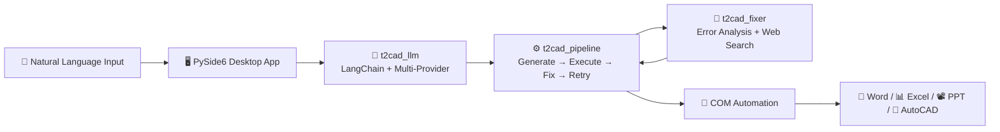

# TextToCAD 🏗️

> **自然语言驱动 Office 文档与 AutoCAD 绘图 —— 基于 LLM 的智能生成引擎**
>
> *Natural language → Word documents, Excel spreadsheets, PowerPoint slides & AutoCAD DXF drawings — powered by LLMs.*

<p align="center">
  
  
  
  
  
  
</p>

---

## 📖 Overview

**TextToCAD** transforms natural language instructions into production-ready documents and engineering drawings. Instead of manually clicking through Word, Excel, PowerPoint, or AutoCAD, you type what you want in plain Chinese (or English) — the LLM generates executable Python code that drives the target application's COM automation layer in real-time.

Each tool is a standalone **PySide6 desktop GUI** backed by a shared LLM infrastructure:
- A unified **LangChain** client (`t2cad_llm.py`) with multi-provider support (DeepSeek, Claude, GPT) and conversation memory
- A **LangGraph-inspired code-generation pipeline** (`t2cad_pipeline.py`) with automatic generate → execute → error-analysis → fix → retry loops
- A shared **error-fixing module** (`t2cad_fixer.py`) with web search and COM HRESULT decoding
- A **4D evaluation engine** (`t2cad_eval.py`) for systematic quality measurement



---

## ✨ Features

### 📄 Word Generation (`TextToCAD_Word.py`)
- **Documents, reports, tables, and forms** from natural language descriptions
- Full COM automation through `win32com`: page layout, headers/footers, styles, table operations
- Supports complex formatting: merged cells, table auto-fit, multi-section documents, TOC generation
- 1,768 lines of battle-tested code with detailed COM fixer knowledge

### 📊 Excel Generation (`TextToCAD_Excel.py`)
- **Spreadsheets, charts, data analysis reports** from natural language
- Pre-injected safe functions: `BEAUTIFY()`, `MERGE()`, `CHART()`, `COND_FMT()`, `NEW_SHEET()`
- COM HRESULT error decoding for 7 Excel cell error types (`#DIV/0!`, `#VALUE!`, `#REF!`, etc.)
- Cross-sheet data traversal and multi-sheet analysis workflows

### 📽️ PowerPoint Generation (`TextToCAD_PPT.py`)
- **Professional slide decks** with design rules encoded in the system prompt
- 16:9 layout (960×540), curated color palette, typography guidelines
- Pre-injected shape/text/table/image functions with alignment and z-order control
- Fixer prompt encodes deep PowerPoint COM knowledge (shapes, text frames, color models)

### 📐 AutoCAD Generation (`TextToCAD_AutoCAD.py`)
- **Architectural and mechanical drawings** via `pyautocad` COM bridge
- Built-in safe drawing functions: `L()`, `C()`, `R()`, `DIM()`, `PLINE()`, `ARC()`, `HATCH()`, `MTEXT()`
- Layer management, block insertion, batch operations for performance
- TArch (天正建筑) integration for professional architectural objects (walls, doors, windows, axes)
- DXF export support

### 📊 Evaluation Engine (`t2cad_eval.py`)
- **4-Dimensional Scoring**: Syntax (20%), Safety (30%), Task Fit (30%), Code Quality (20%)
- Project-level dataset hierarchy: `gold_set/` → `edge_cases/` → `regression/`
- CLI interface: `run`, `compare`, `report` commands with JSON output
- V1 → V2 migration support with automatic backup

---

## 🧰 Tech Stack

| Layer | Technology |
|-------|-----------|
| **LLM SDK** | [LangChain](https://www.langchain.com/) + [LangGraph](https://www.langchain.com/langgraph) |
| **LLM Backends** | DeepSeek (primary), OpenAI, Anthropic Claude |
| **Desktop UI** | [PySide6](https://wiki.qt.io/Qt_for_Python) (Qt for Python) |
| **Office Automation** | `win32com` (COM automation for Word/Excel/PowerPoint) |
| **CAD Automation** | [pyautocad](https://github.com/reclosedev/pyautocad) |
| **DXF Export** | [ezdxf](https://ezdxf.readthedocs.io/) |
| **Evaluation** | AST-based static analysis, regex pattern matching, project-level dataset management |
| **Platform** | Windows (required for COM automation) |

---

## 🚀 Installation

### Prerequisites
- **Windows** (COM automation requires Microsoft Office and/or AutoCAD installed)
- Python 3.10+
- Microsoft Office (for Word/Excel/PPT tools)
- AutoCAD (for CAD tool)

### Setup

```bash
# 1. Clone the repository
git clone https://github.com/zhao818/TextToCAD.git
cd TextToCAD

# 2. Install dependencies
pip install -r requirements_langchain.txt

# 3. Configure API keys
cp config.example.json ~/.text_to_cad/config.json
# Edit ~/.text_to_cad/config.json and add your API key
```

### Configuration (`~/.text_to_cad/config.json`)

```json
{
  "provider": "deepseek",
  "api_key": "sk-YOUR-DEEPSEEK-API-KEY",
  "api_base": "https://api.deepseek.com/v1",
  "model": "deepseek-chat",
  "temperature": 0.0,
  "max_tokens": 4096,
  "language": "zh",
  "units": "mm",
  "auto_execute": true,
  "show_code": true
}
```

Supported providers: `deepseek`, `openai`, `claude`, `bridge` (file-based, air-gapped mode).

---

## 🏃 Quick Start

Launch any tool directly — each is a standalone desktop application:

```bash
# Word: Generate documents, reports, and tables
python TextToCAD_Word.py

# Excel: Generate spreadsheets, charts, and data analysis
python TextToCAD_Excel.py

# PowerPoint: Generate professional slide decks
python TextToCAD_PPT.py

# AutoCAD: Generate engineering drawings and DXF files
python TextToCAD_AutoCAD.py
```

Each tool opens a PySide6 window with:
- An input field for natural language instructions
- A code preview pane showing the LLM-generated Python code
- Real-time status indicators for the generate → execute → fix pipeline
- The target application (Word/Excel/PPT/AutoCAD) being driven live

### Example Prompts

| Tool | Prompt |
|------|--------|
| **Word** | `创建一份项目计划书，包含封面、目录、项目背景、时间安排表格和风险评估` |
| **Excel** | `分析销售数据表，按区域汇总销售额，生成柱状图和汇总报告表` |
| **PPT** | `制作一份产品发布会PPT，深蓝风格，包含封面、产品亮点、市场分析、团队介绍共8页` |
| **AutoCAD** | `绘制一个100平米两室一厅的户型图，含墙体、门窗、尺寸标注和家具布置` |

---

## 📁 Project Structure

```
TextToCAD/
├── TextToCAD_Word.py       # Word document generation (1,768 lines)
├── TextToCAD_Excel.py      # Excel spreadsheet generation (1,095 lines)
├── TextToCAD_PPT.py        # PowerPoint slide generation (806 lines)
├── TextToCAD_AutoCAD.py    # AutoCAD drawing generation (1,154 lines)
│
├── t2cad_llm.py            # Unified LLM client (LangChain + fallbacks)
├── t2cad_pipeline.py       # Code-gen pipeline (generate → execute → fix → retry)
├── t2cad_fixer.py          # Error analysis + web search + COM HRESULT decoding
│
├── t2cad_eval.py           # 4D evaluation engine (1,090 lines)
├── test_langchain.py       # Smoke tests for LLM + pipeline integration
│
├── eval/
│   ├── datasets/           # Test case datasets
│   │   └── t2cad/
│   │       └── gold_set/   # Must-pass test cases for each tool
│   │           ├── word_cases.json
│   │           ├── excel_cases.json
│   │           ├── ppt_cases.json
│   │           └── cad_cases.json
│   └── results/            # Historical evaluation results
│
├── config.example.json     # Configuration template
├── requirements_langchain.txt  # Python dependencies
└── .gitignore
```

---

## 🧪 Evaluation Framework

TextToCAD includes a production-grade evaluation engine with **4-dimensional scoring**:

| Dimension | Weight | What It Measures |
|-----------|--------|-----------------|
| **Syntax** | 20% | `ast.parse()` — is the code syntactically valid? |
| **Safety** | 30% | Banned patterns detection (no `import`, no `Dispatch`, no `eval`, no file I/O) |
| **Task Fit** | 30% | Does the code use required functions and avoid prohibited ones? Matches expected operations? |
| **Quality** | 20% | Anti-patterns (bare `except`, `while True`), naming conventions, code length, comments |

### Usage

```bash
# Run all test suites for a tool
python t2cad_eval.py run --project t2cad --tool excel

# Run a specific suite
python t2cad_eval.py run --project t2cad --tool excel --suite regression

# Dry run (no LLM calls)
python t2cad_eval.py run --project t2cad --tool excel --suite all --dry

# Compare results across runs
python t2cad_eval.py compare --project t2cad --tool excel

# Generate weekly report
python t2cad_eval.py report --project t2cad --last 7days --format markdown
```

### Dataset Hierarchy

```
eval/datasets/<project>/
├── gold_set/      # Must-pass: core functionality tests
├── edge_cases/    # Robustness: boundary conditions
└── regression/    # Regression: previously-fixed bugs
```

### Test Case Format

```json
{
  "name": "创建基础表格并美化",
  "description": "Test basic table creation with formatting",
  "snapshot": "当前工作簿有1个工作表: Sheet1",
  "user_input": "在Sheet1创建销售数据表，包含日期、产品、数量、金额列，并美化",
  "checks": {
    "must_use": ["BEAUTIFY"],
    "must_not_use": ["Workbooks.Open"],
    "expected_operations": ["Range", "Value"],
    "should_contain": ["表头", "边框"]
  },
  "difficulty": "easy",
  "tags": ["table", "formatting"]
}
```

---

## 🔧 Architecture Deep-Dive

### LLM Client (`t2cad_llm.py`)

The `LLMClient` provides a unified interface across providers:

- **Primary path**: LangChain `ChatOpenAI` (compatible with DeepSeek, OpenAI, and any OpenAI-compatible endpoint)
- **Fallback**: Raw `requests` for resilience
- **Bridge mode**: File-based I/O for air-gapped workflows (`~/.text_to_cad/bridge/`)
- **Memory**: `chat_with_memory()` maintains conversation context across turns with automatic pruning

### Code Generation Pipeline (`t2cad_pipeline.py`)

Inspired by LangGraph's state-machine pattern, the pipeline implements:

```
┌──────────┐    ┌──────────┐    ┌────────────┐    ┌──────────┐    ┌──────────┐
│ GENERATE │ →  │ EXECUTE  │ →  │  ANALYZE   │ →  │   FIX    │ →  │  RETRY   │
│  (LLM)   │    │ (exec()) │    │ (explain + │    │ (fixer   │    │ (loop)   │
│          │    │          │    │  web srch) │    │  prompt) │    │          │
└──────────┘    └──────────┘    └────────────┘    └──────────┘    └──────────┘
                     │                                                    │
                     ▼                                                    │
              ┌────────────┐                                              │
              │ ✓ SUCCESS  │◄─────────────────────────────────────────────┘
              └────────────┘       (up to max_retries, default 6)
```

Key design decisions:
- **Not a hard LangGraph dependency** — uses the pattern without requiring `langgraph` at runtime, keeping installation simple
- **Progress callbacks** for real-time UI updates during generation
- **Code history** tracking (`all_codes`) for debugging failed generations

### Error Fixer (`t2cad_fixer.py`)

When generated code fails at runtime:
1. **Error localization** — parses tracebacks to find the exact failing line of AI-generated code
2. **COM HRESULT decoding** — translates Windows COM error codes (`DISP_E_MEMBERNOTFOUND`, etc.) into human-readable Chinese explanations
3. **Web search** — queries DuckDuckGo for related solutions when errors are unfamiliar
4. **Expert fixer prompt** — each tool has a custom fixer system prompt encoding deep COM domain knowledge (200+ lines of API reference per tool)

---

## 🤝 Contributing

Contributions are welcome! Areas that could use help:

- **English localization** — the UI and prompts are primarily Chinese; i18n support would broaden the audience
- **Additional providers** — Ollama (local models), Groq, etc.
- **Cross-platform support** — exploring `python-docx`/`openpyxl`/`python-pptx` fallback paths for non-Windows
- **Test cases** — add to `eval/datasets/t2cad/gold_set/` for any tool
- **Web UI** — a browser-based interface as an alternative to PySide6

### Development Setup

```bash
pip install -r requirements_langchain.txt
python test_langchain.py  # Verify LLM connectivity
```

---

## 📄 License

This work is licensed under a [Creative Commons Attribution-ShareAlike 4.0 International License](https://creativecommons.org/licenses/by-sa/4.0/).

---

## 👤 Author

**赵天兵 (Zhao Tianbing)** — [GitHub @zhao818](https://github.com/zhao818)

---

<p align="center">
  <sub>Built with ❤️ using Python, LangChain, and years of COM automation battle scars.</sub>
</p>
